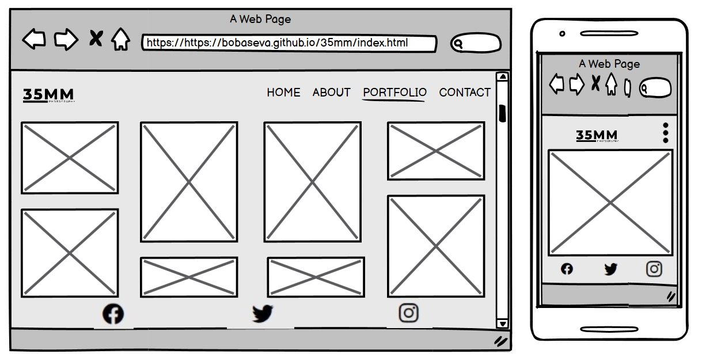
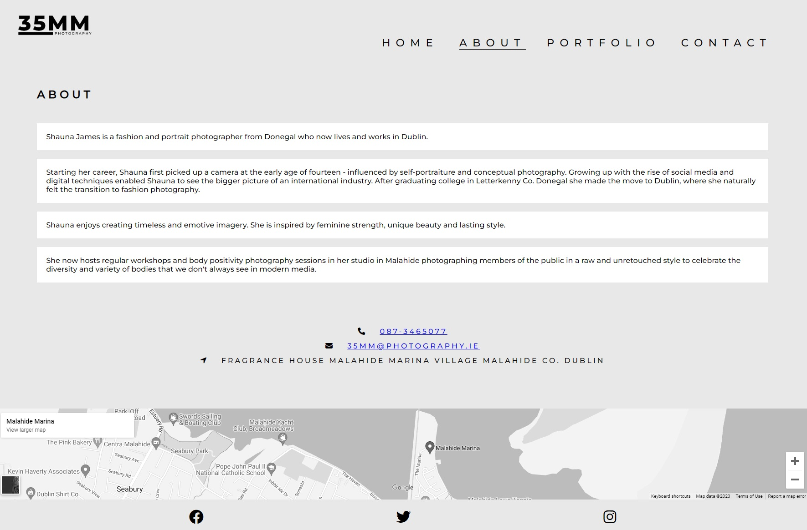

# 35mm Phototgraphy

[View deployed project here](https://bobaseva.github.io/35mm/index.html)
---

## Table of Contents

- [35mm Phototgraphy](#35mm-phototgraphy)
  - [View deployed project here](#view-deployed-project-here)
  - [Table of Contents](#table-of-contents)
  - [Introduction](#introduction)
  - [User stories](#user-stories)
    - [Business Goals](#business-goals)
    - [User goals](#user-goals)
  - [Design](#design)
    - [Colour Scheme](#colour-scheme)
    - [Typography](#typography)
    - [Imagery](#imagery)
    - [Wireframes](#wireframes)
    - [Home](#home)
    - [About](#about)
    - [Portfolio](#portfolio)
    - [Contact](#contact)
  - [Features](#features)
    - [Header with responsive navigation](#header-with-responsive-navigation)
    - [Footer with Social Media icons](#footer-with-social-media-icons)
    - [Landing/Home page](#landinghome-page)
    - [About page](#about-page)
    - [Portfolio](#portfolio-1)
    - [Contact](#contact-1)
    - [Future Implementations](#future-implementations)
    - [Accessibility](#accessibility)
  - [Programs and Applications](#programs-and-applications)
    - [Languages](#languages)
  - [Deployment](#deployment)
    - [Local Development](#local-development)
      - [How to Clone](#how-to-clone)
      - [How to Fork](#how-to-fork)
  - [Testing](#testing)
    - [CSS Validation](#css-validation)
    - [HTML Validation](#html-validation)
    - [Performance](#performance)
    - [Accessibility](#accessibility-1)
    - [Manual Testing](#manual-testing)
  - [Credits](#credits)
    - [Code Used](#code-used)
    - [Content](#content)
    - [ Media](#media)
    - [ Acknowledgments](#acknowledgments)

---
## Introduction

This project was created as proposed website for photography business based in Co Dublin, Ireland. The target audience is mainly potential photography business customers looking for particular style portraits as artist is specialising mainly on black and white photography. The website was designed to be user-friendly, functional and responsive across all devices.
This website was built as a project for Diploma in Full Stack Software Development at Code Institute. The requirement was to build a static front-end site to present useful information to users, using HTML5 and CSS3.

## User stories

### Business Goals

1.	To introduce business for potential customers
2.	To familiarise existing and potential customers with the product
3.	To build and increase communication with customers

### User goals

1.	To learn about the business
2.	To navigate around the website easily
3.	To know what to expect from the business be reviewing the existing portfolio
4.	To be able to get in contact with the business

## Design

### Colour Scheme

 

The colour scheme was inspired by the business itself as the artist is specialising in the black and white photography. Using Adobe Color Extract Theme function the base colours were chosen for the website, starting with #e8e8e8 as the main background colour.

### Typography

The google font ‘Montserrat’ was for all text across the website as this is the font used in the business logo build in Canva by the developer. The font was imported from Google Fonts.

 

### Imagery

Images used for Portfolio and background were sourced from Pexels.com. All images were compressed through Shutterstock Image resizer. Chosen images are by random artists and were picked solely based on the style of the business product.

### Wireframes

### Home
 

### About
 

### Portfolio
 

### Contact
 

## Features

### Header with responsive navigation

1.	Located at the top of the page, Navbar has business logo (linking to the Home page) in the left corner and for smaller screen it moves toward the centre of the screen
2.	In the right top corner there is main Menu/Navigation bar which consists of Home, About, Portfolio and Contact linking to according pages.
3.	All navigation text is in Uppercase
4.	The active page is underlined.

Desktop version nav bar with menu

Mobile version nav bar hamburger menu 

### Footer with Social Media icons

All pages have footer containing Social Media information of the business, providing clickable icons that link to Facebook, Twitter and Instagram accounts of 35mm Photography.
The About Page has additional information to its footer providing Contacts information, such as Phone Number, Email, Address and Google Map section showing the location of Photography Studio.

### Landing/Home page

The Home page has a beautiful background picture, showcasing one of the photographers works, giving a website visitor an idea of what kind of business and product, he/she is about to visit. This Landing Page is very simple and straightforward, it has one active button which leads to About Page. The purpose of this page is purely introductory.

### About page

The About page features short summary about the photographer’s career path following with Contacts information about the location of her studio.

### Portfolio

The Portfolio is the main part of the photographer’s business, thus this page was created as the centre of the website showcasing beautiful gallery of black and white photographs. This gallery has very responsive layout going from 4 columns to 2 and ending with 1 column, all according to the size of the screen.

### Contact

The contact page allows user to contact photographer, make an inquiry, or book a meeting. The page has eye-catching background image and all fields in the form are validated and will provide user with the warning message in case the fields are filled incorrectly.

### Future Implementations

Overall performance of the website can be improved as some parts of the site are slowing it down, also photoshoot booking system through visible open dates on the calendar can be added in the future as unfortunately this type of addition required more technical knowledge.

### Accessibility

Aria-labels for screen readers are implemented at certain places, also semantic elements are used so the page is easy to navigate.

## Programs and Applications

**GitHub** – storage and deployment 
**Codeanywhere** – IDE used to write, edit, commit and push the code to GitHub 
**Google Fonts** – import font 
**Shutterstock Image-resizer** – compress images 
**Font Awesome**- import social media and contact icons 
**Favicon Generator Website** – convert logo 
**Balsamiq** – wireframes design 
**Am I Responsive?** – check responsiveness of the website 
**Google Maps** – embed map location 

### Languages

**HTML** 
**CSS**

## Deployment

The project was developed in CodeAnywhere application where it was committed and pushed to GitHub which was then committed and pushed to GitHub where it was deployed.

### Local Development

#### How to Clone

1. Log into your account on github
2. Go to the repository of this project /adrianskelton/Projecto1/
3. Click on the code button, and copy your preferred clone link.
4. Open the terminal in your code editor and change the current working directory to the location you want to use for the cloned directory.
5. Type 'git clone' into the terminal, paste the link you copied in step 3 and press enter.

#### How to Fork

To fork the repository:

1. Log in (or sign up) to Github.
2. Go to the repository for this project, adrianskelton/Projecto1
3. Click the Fork button in the top right corner.

## Testing

### CSS Validation

The CSS code was validated using W3C tool.

### HTML Validation

Every page of the website was validated using the W3C tool.

### Performance

Website performance was checked with Lighthouse tool.

### Accessibility

To check accessibility the Wave Web Accessibility Evaluation tool was used. One error was detected due to the page design and lack of Heading on the page. 

### Manual Testing

Manual testing was done to check common elements and how the perform on different devices:

1.	Clicking on the Navbar links brings the user to according page
2.	Clicking on Logo brings the user to the Home page.
3.	The responsiveness of the Home page
4.	Clicking on the button from the Home page brings the user to the About page
5.	The responsiveness of the About page
6.	Clicking on View Larger Map button of the map brings the user to correct location.
7.	Clicking on the Social Media icons brings the user to correctly allocated Social Media pages
8.	The responsiveness of the Portfolio page
9.	The responsiveness of the Contact page
10.	Filling out the form user must fill in all fields in order to be able to submit

Following devices were used:

Laptop:
* Acer Aspire 5 A515-56
Mobile Devices:
* Samsung Galaxy Z Fold 4
* Google Pixel 6
  
Mobile Devices:
* Google Chrome
* Firefox
* Safari

## Credits

### Code Used

1.	The Navigation bar code was used from Love Running Project Challenge
2.	Portfolio section code was used from Love Running Project Challenge
3.	Contact form with validation was used from w3schools.com
4.	The rest of the code was borrowed and modified mostly from w3schools.com, stackoverflow.com and Love Running Project Challenge

### Content

All content was written and created by the developer.

###  Media

Images were downloaded from royalty free website pexels.com (https://www.pexels.com).

  
###  Acknowledgments

My mentor Luke for continuous support and helpful feedback.